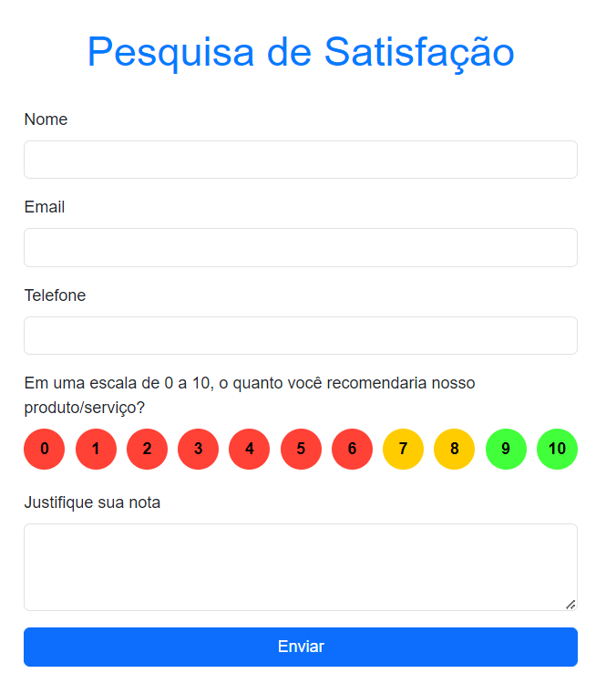
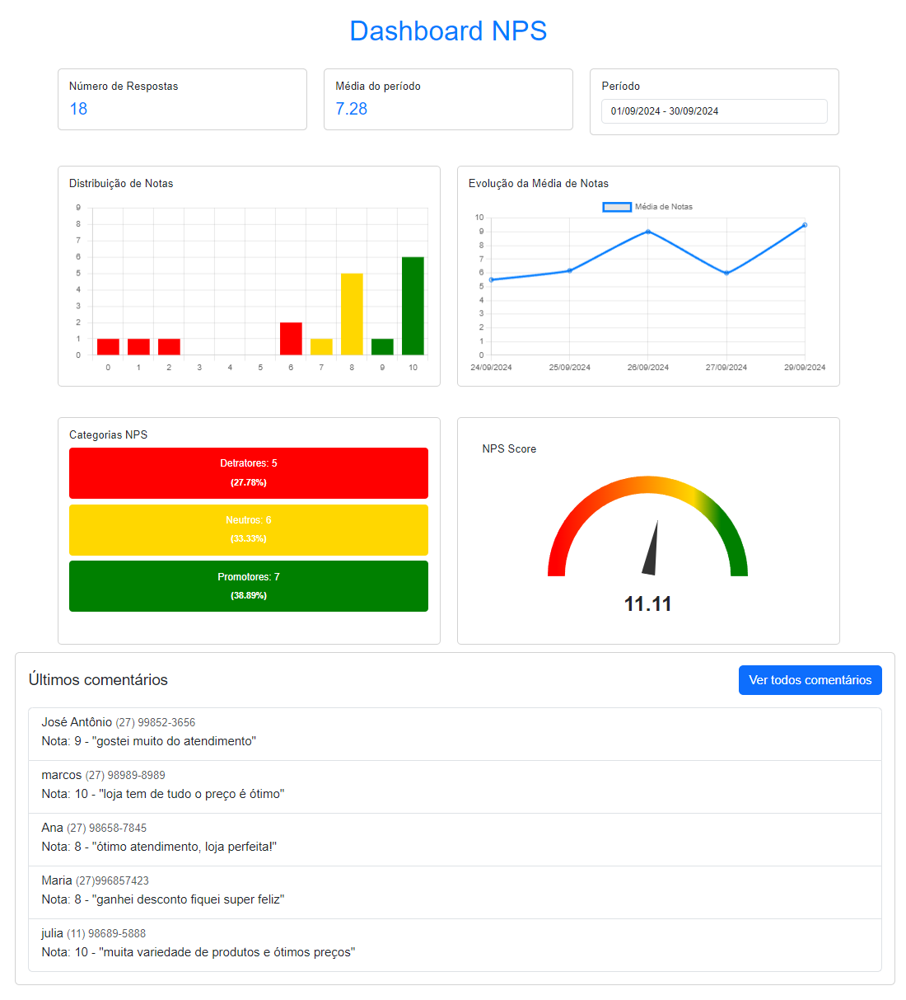
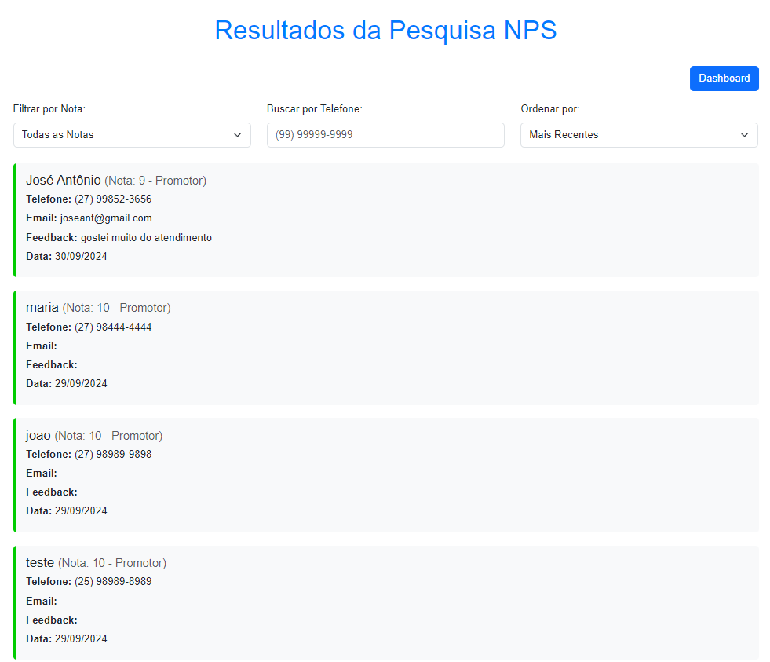

# Sistema NPS (pesquisa de satisfação)

## Instalação

1. Clone o repositório: 
  - git clone https://github.com/marcosgbarros/sistema-NPS.git
2. Navegue até o diretório do projeto: 
  - cd NPS
4. Instale as dependências 
  - npm install
5. Rode o projeto 
  - node server.js  
obs: certifique se de ter o node js instalado no computador, caso não tenha, faça download pelo link abaixo. 
   https://nodejs.org/dist/v20.17.0/node-v20.17.0-x64.msi   

# Abra o navegador e cole os endereços abaixo para acessar o sistema  
## Acesso a página de pesquisa 
http://localhost:3000/survey.html  
## Acesso ao dashboard 
http://localhost:3000/dashboard.html  
## Acesso aos feedbacks 
http://localhost:3000/feedback.html  

## Imagens do projeto 
 
 

